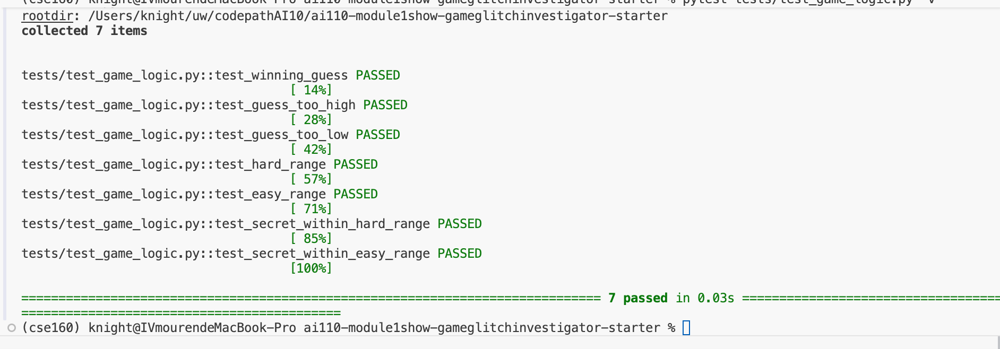
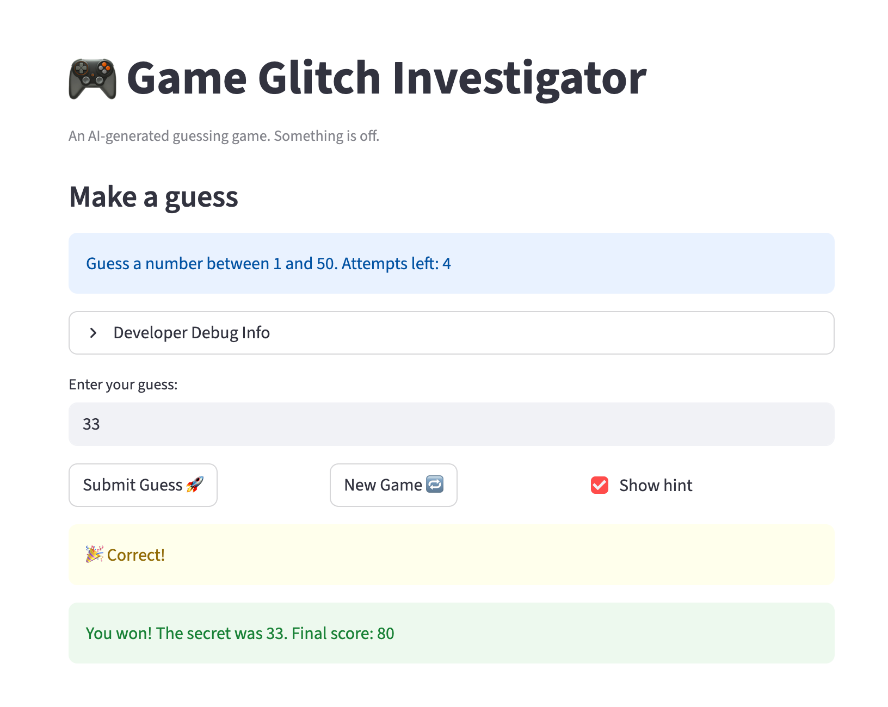

# 🎮 Game Glitch Investigator: The Impossible Guesser

## 🚨 The Situation

You asked an AI to build a simple "Number Guessing Game" using Streamlit.
It wrote the code, ran away, and now the game is unplayable. 

- You can't win.
- The hints lie to you.
- The secret number seems to have commitment issues.

## 🛠️ Setup

1. Install dependencies: `pip install -r requirements.txt`
2. Run the broken app: `python -m streamlit run app.py`

## 🕵️‍♂️ Your Mission

1. **Play the game.** Open the "Developer Debug Info" tab in the app to see the secret number. Try to win.
2. **Find the State Bug.** Why does the secret number change every time you click "Submit"? Ask ChatGPT: *"How do I keep a variable from resetting in Streamlit when I click a button?"*
3. **Fix the Logic.** The hints ("Higher/Lower") are wrong. Fix them.
4. **Refactor & Test.** - Move the logic into `logic_utils.py`.
   - Run `pytest` in your terminal.
   - Keep fixing until all tests pass!

## 📝 Document Your Experience

### Game Purpose
A number guessing game built with Streamlit. The player selects a difficulty (Easy: 1–20, Normal: 1–100, Hard: 1–50), then guesses the secret number within a limited number of attempts. Each guess receives a "Go Higher" or "Go Lower" hint, and a score is tracked across guesses.

### Bugs Found and Fixed

| # | Bug | Root Cause | Fix |
|---|-----|-----------|-----|
| 1 | Hints always said "Go Lower" regardless of guess | `secret` was cast to a `str` on even-numbered attempts, causing lexicographic comparison instead of numeric | Always pass `secret` as an integer to `check_guess` |
| 2 | New game after losing was unplayable | `st.session_state.status` was never reset to `"playing"` on new game, so `st.stop()` blocked all input | Reset `status`, `history`, and `game_count` in the new game handler |
| 3 | Input field kept the previous round's guess | Text input `key` never changed between games | Added `game_count` to the input key so Streamlit renders a fresh widget each new game |
| 4 | Attempts display showed "1 left" while game-over fired | `st.info` rendered at the top before the submit handler incremented `attempts` | Replaced `st.info` with `st.empty()` placeholder; updated it after the increment |
| 5 | Out-of-range numbers produced no feedback | No range validation — numbers outside `[low, high]` passed silently to `check_guess` | Added an `elif` range check after `parse_guess` that shows an error message |
| 6 | Higher/Lower hints were reversed | `guess > secret` returned "Go HIGHER!" instead of "Go LOWER!" | Swapped the two return messages in `check_guess` |
| 7 | Hard and Easy mode secrets could exceed their range | New game handler hardcoded `random.randint(1, 100)` regardless of difficulty | Changed to `random.randint(low, high)` using the difficulty range |

## 📸 Demo

- [ ] [Insert a screenshot of your fixed, winning game here]

## 🚀 Stretch Features

- [ ] [If you choose to complete Challenge 4, insert a screenshot of your Enhanced Game UI here]
